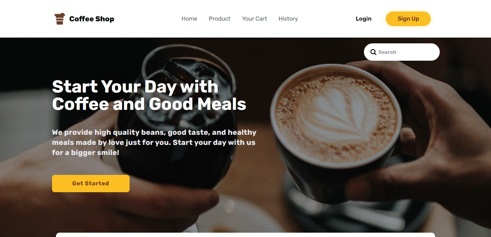

<h1 align='center'>Frontend - Coffeeshop</h1>
  <p align="center">
    <a href="https://b22-coffeeshop.netlify.app/">View Demo</a>
    ·
    <a href="https://github.com/CUPAXX/b22-frontend-coffeshop/issues">Report Bug</a>
    ·
    <a href="https://github.com/CUPAXX/b22-frontend-coffeshop/pulls">Request Feature</a>
  </p>



## About The Project

This project for Frontend user client from <a href="https://github.com/CUPAXX/b22-backend-coffeeshop">this Backend</a>

## Built With

[](https://github.com/facebook/react)
[](https://tailwindcss.com/docs)

## Requirements

1. <a href="https://nodejs.org/en/download/">Node Js</a>
2. Node_modules `npm install` or `yarn install`
3. Backend API Coffeeshop [`here`](https://github.com/CUPAXX/b22-backend-coffeeshop)

## Getting Started

1. Download this Project or you can type `git clone https://github.com/CUPAXX/b22-frontend-coffeshop`
2. Open app's directory in CMD or Terminal
3. Type `npm install` or `yarn install`
4. Add .env file at root folder project

```sh
REACT_APP_BACKEND_URL=http://localhost:8080 //[Backend API]
```

5. Type `npm run serve`

# Feature
<ul>
<li>Login & Register</li>
<li>Get User</li>
<li>delete User</li>
<li>Update Profile</li>
<li>Get Items</li>
<li>Transaction</li>
<li>Add to Cart</li>
<li>History Transaction</li>
</ul>

## Acknowledgements

- [Axios](https://www.npmjs.com/package/axios)
- [React](https://reactjs.org/)
- [React Tailwind](https://tailwindcss.com/docs)

## License

© [M Fiqry Arahmansyah](https://github.com/CUPAXX)